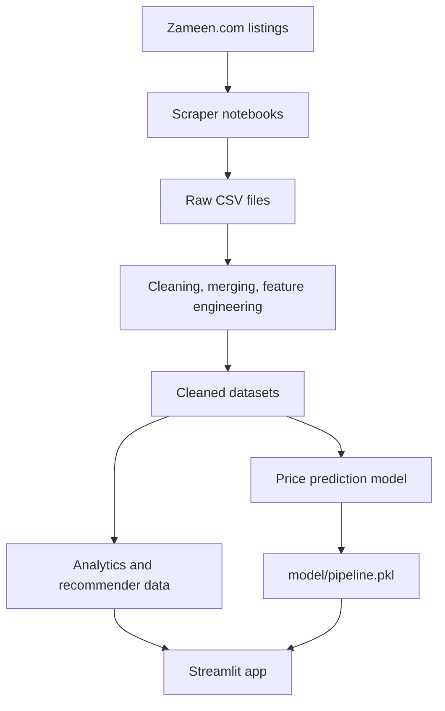

<div align="center">


# 🏙️ Karachi Real Estate Intelligence Platform

**Predict prices. Explore the market. Find the right property.**

An end-to-end machine-learning and analytics web app built on 20,000+ Karachi property listings.

<p align="center">
  
  
  
  <br>
  
  
  
</p>

[**🚀 Live App**](https://karachi-real-estate-intelligence-platform-efuxjzdeqygvpqjmm4bm.streamlit.app/) ·
[Demo Video](#-demo-video) ·
[Screenshots](#-application-preview) ·
[Features](#-features) ·
[How It Works](#-how-it-works) ·
[Quick Start](#-quick-start) ·
[Roadmap](#-roadmap)

</div>

---

## 📑 Table of Contents

- [Demo Video](#-demo-video)
- [Application Preview](#-application-preview)
- [About](#-about)
- [Features](#-features)
- [How It Works](#-how-it-works)
- [App Modules](#-app-modules)
- [Quick Start](#-quick-start)
- [Tech Stack](#-tech-stack)
- [Project Structure](#-project-structure)
- [Limitations](#-limitations)
- [Roadmap](#-roadmap)
- [Contributing](#-contributing)

---

## 🎬 Demo Video

https://github.com/user-attachments/assets/68945489-7005-4fdd-9b98-fc528b1e885f

<div align="center">

🔗 **Try it live:** [Karachi Real Estate Intelligence Platform](https://karachi-real-estate-intelligence-platform-efuxjzdeqygvpqjmm4bm.streamlit.app/)

</div>

---

## 📸 Application Preview

<div align="center">

### 🏠 Landing Page


### 💰 Price Predictor


### 📊 Market Analytics

**3D & 2D Spatial Maps (PyDeck)**


**Radar / Spider Chart**


**Pie Chart**


**Scatter Plot**


**Box Plot**


**Distribution Plot**


### 🎯 Property Recommender


</div>

---

## 📖 About

Property prices in Karachi vary hugely by district, society, and sub-location, and listing data is messy and inconsistent. This project turns raw **Zameen.com** listings into a clean, structured dataset and builds three tools on top of it:

| | Module | What it does |
|---|---|---|
| 💰 | **Price Predictor** | Estimates a property's market price from its details |
| 📊 | **Market Analytics** | Compares districts, locations, and sub-locations with interactive charts and maps |
| 🎯 | **Property Recommender** | Filters and ranks listings against your preferences |

---

## ✨ Features

- **Full data-science lifecycle:** scraping → cleaning → EDA → modeling → deployment
- **Large real-world dataset:** 20,000+ flat and house listings, cleaned separately and then merged
- **Karachi-specific location standardization:** inconsistent area names mapped into parent locations and sub-locations
- **Price prediction** through a reusable scikit-learn pipeline, with an estimated price range
- **Interactive analytics** with Plotly charts and PyDeck 2D/3D maps
- **Explainable recommender** using transparent weighted scoring
- **Flexible units:** supports square feet and square yards

---

## 🧭 How It Works



### 1. Data pipeline

| Step | Details | Notebooks |
|---|---|---|
| **Scrape** | Price, area, bedrooms, bathrooms, kitchen, location, address, completion year, parking, furnishing, electricity backup, servant quarters | `scraper/flats_scraper.ipynb`, `scraper/house_scraper.ipynb` |
| **Clean** | Flats and houses cleaned separately: prices, areas, rooms, years | `1_data_cleaning_flats`, `2_data_cleaning_house` |
| **Merge** | Combined into one dataset with a `property_type` column | `3_merge_flats_and_house` |
| **Standardize locations** | Spelling, road, society, and project-name variants mapped to consistent locations | location notebooks |
| **Handle missing values** | Remove, default-fill, group as `Unknown`, set to `NaN`, or estimate from related records | `8_`, `9_`, `handle_missing_values-3` |
| **Engineer features** | Derived variables for analysis and modeling | feature-engineering notebooks |
| **EDA and selection** | Univariate, multivariate, and profiling analysis; multi-method feature selection | `5_` to `7_`, `11-Feature_Selection` |

<details>
<summary><b>🧮 Engineered features</b></summary>

<br>

| Feature | Description |
|---|---|
| `price_per_sqft` | `price / area` for fair comparison across sizes |
| `property_age` | `current_year - completion_year` |
| `age_category` | Under Construction (< 0), New (0), Relatively New (1–5), Moderately Old (6–10), Old (> 10) |
| `area_per_bedroom` | `area / bedrooms` |
| `location_score` | Higher for premium locations, lower for developing ones |
| `sub_location_score` | Based on price-per-sqft statistics, with group-size handling so tiny groups don't dominate |
| `luxury_score`, `parking_score`, `servant_quarter_score` | Amenity-based scores |
| `sub_location_type`, `district` | Location categories |

</details>

<details>
<summary><b>🔍 Feature selection methods</b></summary>

<br>

To find stable predictors rather than trusting a single technique, the project compares: correlation analysis, Random Forest importance, Gradient Boosting importance, permutation importance, Lasso coefficients, Recursive Feature Elimination, and linear-model coefficients.

</details>

### 2. Price prediction model

Developed in `notebooks/11-Feature_Selection.ipynb` and `notebooks/12-Baseline_model.ipynb`.

1. Target `price` is transformed with `np.log1p` (prices are right-skewed).
2. Numerical features are scaled and categorical features are encoded.
3. A regression model is trained inside a scikit-learn `Pipeline`.
4. The model is evaluated with a train/test split and cross-validation.
5. The pipeline is saved as `model/pipeline.pkl`.

In the app, predictions are converted back with `np.expm1`, and the page displays an estimated price with a price range.

### 3. Recommendation engine

`src/recommender.py` is a **deterministic scoring system** (not a trained model), which keeps results easy to explain.

```text
Final score = 35% Location  +  35% Property  +  30% Amenities
```

| Score | Components |
|---|---|
| **Hard filters** | Property type, bedrooms, area range, price range |
| **Location (35%)** | Exact sub-location match → same parent location → nearby areas via Haversine distance |
| **Property (35%)** | Type 35% · Bedrooms 30% · Area 20% · Age 15% |
| **Amenities (30%)** | Parking 40% · Furnished 25% · Kitchen 15% · Electricity backup 12% · Servant quarters 8% |

If a user leaves some preferences blank, the active weights are rebalanced automatically.

---

## 🖥️ App Modules

<details open>
<summary><b>💰 Price Predictor</b> — <code>app/pages/1_Price Predictor.py</code></summary>

<br>

- **Inputs:** property type, district, location, sub-location, area and unit, bedrooms, bathrooms, kitchen, total floors, floor category, age category, furnished status, parking, servant quarters, electricity backup
- **Unit conversion:** `1 sq yd = 9 sq ft`
- **Smart handling:** floor category is set to `Not Applicable` for houses, and invalid location combinations (e.g. `Gadap` under Karachi East, `Jamshed Town` under Korangi) are hidden
- **Output:** estimated price and price range

</details>

<details open>
<summary><b>📊 Analytical App</b> — <code>app/pages/2_Analytical_App.py</code></summary>

<br>

Analyze the market by **district**, **location**, or **sub-location**. Headline metrics include median price, median price per sqft, listing count, and median area. Each visualization answers a different question:

| # | Visualization | Chart type | What it shows | Question it answers |
|---|---|---|---|---|
| 1 | **District Price per Sqft Geomap** | PyDeck map (2D and 3D skyline) | Median price per sqft by area, drawn as colored markers on a heat scale (roughly 7,000 to 36,000 PKR/sqft in the current data) | Where are the high- and low-value zones of the city? |
| 2 | **District Fingerprint Comparison** | Radar / spider chart | Selected districts on five normalized (0–1) axes: price, area, bedrooms, bathrooms, price per sqft | How do districts compare across several metrics at once? |
| 3 | **Area vs. Price** | Scatter plot | Individual listings with area (sqft) on the x-axis and price (PKR) on the y-axis, grouped by bedroom count | How does price scale with size, and which listings look like outliers? |
| 4 | **BHK Distribution** | Pie chart | Share of listings by bedroom configuration (2-BHK, 3-BHK, 4-BHK, and so on) for the chosen location | Which unit sizes dominate supply in this area? |
| 5 | **Property Distribution** | Box plot | Price (in crore PKR) grouped by district or property type | How do spread and median differ between districts? |
| 6 | **Distribution Analysis** | Histogram / KDE | Frequency distribution of a selected numeric variable such as price | How is the market skewed, concentrated, or varied? |

> Values on the map scale reflect the current dataset and will shift as listings are refreshed.

</details>

<details open>
<summary><b>🎯 Recommender App</b> — <code>app/pages/3_Recommender_App.py</code></summary>

<br>

- **Preferences:** location and sub-location, property type, bedrooms, area range, price range, age, parking, furnishing, kitchen, electricity backup, servant quarters, number of results
- **Output:** top-ranked listings with prices, sizes, features, and recommendation scores

</details>

---

## 🚀 Quick Start

**Prerequisites:** Python 3.9+ and `pip`

```bash
# 1. Clone the repository
git clone <your-repository-url>
cd <your-repository-folder>

# 2. Create a virtual environment
python -m venv .venv

# 3. Activate it
.venv\Scripts\Activate.ps1        # Windows PowerShell
# source .venv/bin/activate       # macOS / Linux

# 4. Install dependencies
pip install -r requirements.txt

# 5. Run the app
streamlit run app/Streamlit-app.py
```

The app opens in your browser with the landing page and navigation to all three modules.

> **Re-running the scrapers?** The scraper notebooks also need `requests`, `beautifulsoup4`, and Jupyter, which are not in `requirements.txt`. Install them separately.

---

## 🛠️ Tech Stack

| Area | Tools |
|---|---|
| **App** | Streamlit |
| **Data** | pandas, NumPy |
| **Machine learning** | scikit-learn, category_encoders |
| **Visualization** | Plotly, PyDeck, Matplotlib, Seaborn |
| **Scraping** | requests, BeautifulSoup |
| **Workflow** | Jupyter notebooks |

---

## 📁 Project Structure

```text
.
├── app/
│   ├── Streamlit-app.py            # Landing page
│   ├── pages/
│   │   ├── 1_Price Predictor.py
│   │   ├── 2_Analytical_App.py
│   │   └── 3_Recommender_App.py
│   └── assets/                     # Images and UI assets
├── data/
│   ├── raw/                        # Scraped data (flats, houses)
│   ├── interim/                    # Intermediate cleaning outputs
│   ├── cleaned/                    # Final CSVs for app modules
│   └── processed/                  # Pickle files loaded by Streamlit
├── model/
│   └── pipeline.pkl                # Trained price prediction pipeline
├── src/
│   └── recommender.py              # Filtering, scoring, ranking, distance
├── notebooks/                      # Cleaning, EDA, feature engineering, modeling
├── scraper/                        # Flat and house scraping notebooks
├── docs/
│   └── images/                     # README banner, screenshots, video thumbnail
└── requirements.txt
```

---

## ⚠️ Limitations

- **Asking prices, not sale prices:** the data comes from listings, so it may not reflect final transaction values.
- **Market drift:** prices change over time, so the model needs periodic retraining.
- **Manual location mappings:** these may need updates as new areas appear.
- **Fixed error bands:** the price range is manually configured rather than calculated per location.
- **Schema dependency:** the model requires the same columns and category values used during training.

> 💡 Predictions are estimates for guidance only and are not a formal property valuation.

---

## 🛣️ Roadmap

- [ ] Automated tests for data cleaning and feature engineering
- [ ] Data validation before loading datasets into Streamlit
- [ ] Model versioning and a documented training/export script
- [ ] Periodic retraining on newly scraped listings
- [ ] Location-specific error estimates
- [ ] Model explainability with SHAP or permutation importance
- [ ] Database backend instead of CSV and pickle files
- [ ] User accounts and saved searches
- [ ] Scraper dependencies added to `requirements.txt`

---

## 🤝 Contributing

Contributions, issues, and feature requests are welcome. Open an issue or submit a pull request.

<div align="center">

⭐ If you found this project useful, consider giving it a star!

</div>
